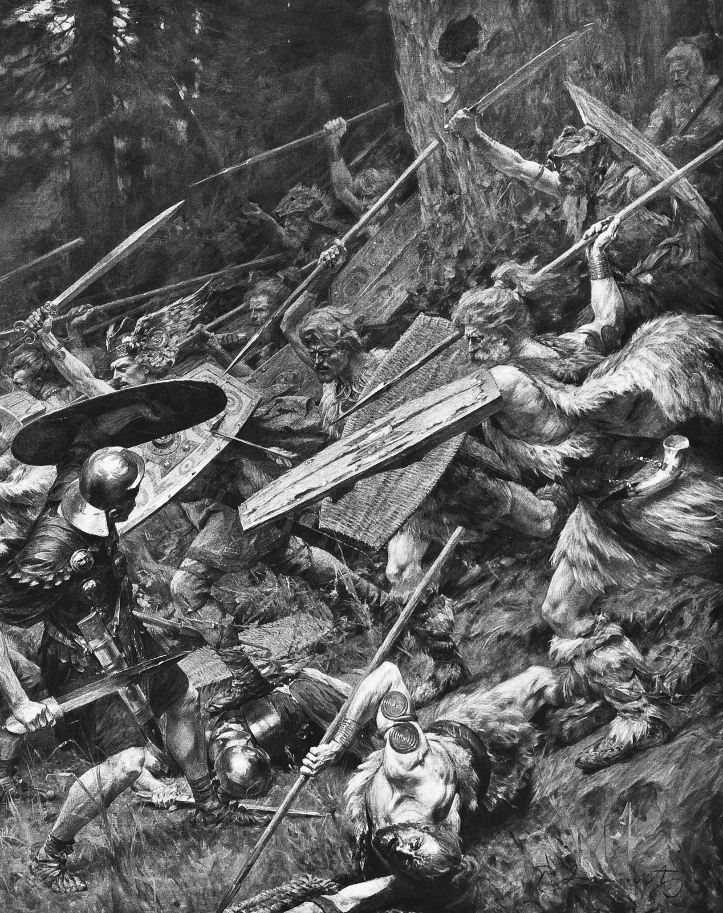

# The Battle of the Teutoburg Forest

Warcraft III custom map featuring the famous [Battle of the Teutoburg Forest](https://en.wikipedia.org/wiki/Battle_of_the_Teutoburg_Forest).

## Credits

* Creator: Baradé
* Loading Screen: Painter Pavle "Paja" Jovanović
* assasin_lord: [HeroGlow](https://www.hiveworkshop.com/threads/heroglow.129462/)
* Fingolfin: [Celtic Town Center](https://www.hiveworkshop.com/threads/celtic-town-center.287546/)
* Fingolfin: [Celtic House](https://www.hiveworkshop.com/threads/celtic-house.287534/)
* Fingolfin: [Celtic Barracks](https://www.hiveworkshop.com/threads/celtic-barracks.287513/)
* Fingolfin: [Celtic Stables](https://www.hiveworkshop.com/threads/celtic-stables.287929/)
* Fingolfin: [Celtic Stockpile](https://www.hiveworkshop.com/threads/celtic-stockpile.289351/)
* Fingolfin: [Celtic Dockyard](https://www.hiveworkshop.com/threads/celtic-dockyard.289350/)
* Fingolfin: [Birch (variation 1)](https://www.hiveworkshop.com/threads/birch-variation-1.255312/)
* Fingolfin: [Birch (variation 2)](https://www.hiveworkshop.com/threads/birch-variation-2.255313/)
* Fingolfin: [Birch (variation 3)](https://www.hiveworkshop.com/threads/birch-variation-3.255315/)
* Fingolfin: [Pine (Variation 1)](https://www.hiveworkshop.com/threads/pine-variation-1.246873/)
* Fingolfin: [Pine (Variation 2)](https://www.hiveworkshop.com/threads/pine-variation-2.246874/)
* Fingolfin: [Pine (Variation 3)](https://www.hiveworkshop.com/threads/pine-variation-3.246875/)
* Fingolfin: [Pine (Variation 4)](https://www.hiveworkshop.com/threads/pine-variation-4.246876/)
* Fingolfin: [Oak (variation 1)](https://www.hiveworkshop.com/threads/oak-variation-1.255316/)
* Fingolfin: [Oak (variation 2)](https://www.hiveworkshop.com/threads/oak-variation-2.255317/)
* Fingolfin: [Oak (variation 3)](https://www.hiveworkshop.com/threads/oak-variation-3.255318/)
* Sin'dorei300: [BarbarianVillager](https://www.hiveworkshop.com/threads/barbarianvillager.222263/)
* HerrDave: [Villager Cavalier Weaponless (Mike)](https://www.hiveworkshop.com/threads/villager-cavalier-weaponless-mike.276643/)
* StonemaulMidget: [Deer](https://www.hiveworkshop.com/threads/deer.335078/)
* HerrDave, Le Shaysonio: [Roman Infantry Pack](https://www.hiveworkshop.com/threads/roman-infantry-pack.337048/)
* Dekarchos, HerrDave: [Additional Roman Infantry](https://www.hiveworkshop.com/threads/additional-roman-infantry.357562/)
* Hoth: [Cage/Transport Chariot pack](https://www.hiveworkshop.com/threads/cage-transport-chariot-pack.331837/)
* Ujimasa Hojo: [Druid of the Talon, Malfurion Stormrage, and Derivatives](https://www.hiveworkshop.com/threads/druid-of-the-talon-malfurion-stormrage-and-derivatives.274058/)
* Mike: [All types castle (on standart textures)](https://www.hiveworkshop.com/threads/all-types-castle-on-standart-textures.273222/)
* Mike: [SiegeWorkshop](https://www.hiveworkshop.com/threads/siegeworkshop.244863/)
* Mike: [Stable](https://www.hiveworkshop.com/threads/stable.241035/)
* Mike: [Towers](https://www.hiveworkshop.com/threads/towers.273887/)
* Mr. Bob: [Academy](https://www.hiveworkshop.com/threads/academy.156115/)
* Mr. Bob: [Greek/Roman Temple](https://www.hiveworkshop.com/threads/greek-roman-temple.107960/)
* Storage: [Storage](https://www.hiveworkshop.com/threads/storage.274516/)
* purparisien: [Ancient Shipyard](https://www.hiveworkshop.com/threads/ancient-shipyard.321677/)
* genin32: [BTNTent](https://www.hiveworkshop.com/threads/btntent.251632/)
* Eagle XI: [Medieval Building Icons](https://www.hiveworkshop.com/threads/medieval-building-icons.275805/)
* MiniMage: [Human Shaman](https://www.hiveworkshop.com/threads/human-shaman.300046/)
* Stanakin: [HumanShaman.blp](https://www.hiveworkshop.com/threads/humanshaman-blp.144004/)
* Mike: [Arcaballista](https://www.hiveworkshop.com/threads/arcaballista.264867/)
* Eagle XI: [BTNArcBallista](https://www.hiveworkshop.com/threads/btnarcballista.271487/)
* Mister_Haudrauf: [Battle Chariot](https://www.hiveworkshop.com/threads/battle-chariot.292219/)
* AndrewOverload519: [Female Human Mage](https://www.hiveworkshop.com/threads/female-human-mage.231160/)
* NFWar: [BTNHorseShoe](https://www.hiveworkshop.com/threads/btnhorseshoe.202888/)
* NFWar: [BTNHorseShoe2](https://www.hiveworkshop.com/threads/btnhorseshoe2.202889/)
* NFWar: [BTNHorseShoe3](https://www.hiveworkshop.com/threads/btnhorseshoe3.202890/)
* Raging Ent: [BTNRomanHelmet](https://www.hiveworkshop.com/threads/btnromanhelmet.188728/)
* Sellenisko: [Vrykul Race Pack](https://www.hiveworkshop.com/threads/vrykul-race-pack.241083/)
* Sellenisko: [BTNRagnarFlamebeard](https://www.hiveworkshop.com/threads/btnragnarflamebeard.249810/)
* Eagle XI: [BTNVrykulHarpooner](https://www.hiveworkshop.com/threads/btnvrykulharpooner.272397/)
* Eagle XI: [BTNVrykulWarrior](https://www.hiveworkshop.com/threads/btnvrykulwarrior.272396/)
* Eagle XI: [BTNVrykulThane](https://www.hiveworkshop.com/threads/btnvrykulthane.272400/)
* BLazeKraze: [Bandit Hide](https://www.hiveworkshop.com/threads/bandit-hide.289286/)
* Mr.Goblin: [TimberWolf.blp](https://www.hiveworkshop.com/threads/timberwolf-blp.96133/)
* Vinz: [Eternity's Crown (1.32)](https://www.hiveworkshop.com/threads/eternitys-crown-1-32.334147/)
* General Frank: [It's a bear trap!](https://www.hiveworkshop.com/threads/its-a-bear-trap.231801/)
